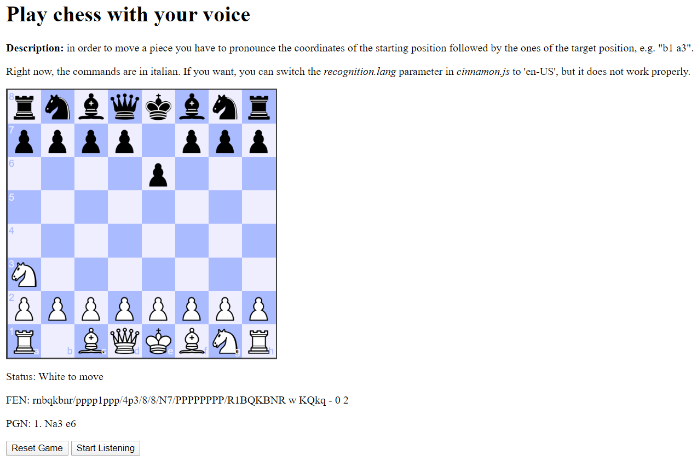

# VocalChess

Play chess with your voice! Small script to play chess by using vocal commands.

</img>

## Description

In order to move a piece you have to pronounce the coordinates of the starting position followed by the ones of the target position, e.g. "b1 a3". Right now, the commands are in italian, not only because it's my language, but also because it works much better than english. If you want, you can try to switch to english by setting the *recognition.lang* parameter to *"en-US"* in *cinnamon.js* file. By the way, you can also use the standard "Drag and drop" method to play.

There are two buttons:
- **Reset Game**: use it to start a new game;
- **Start Listening**: use this button to start the audio recording through your microphone. If you're playing locally, the microphone will be turned off automatically after some seconds (for security reason). In that case, you can click this button to restore the recording.

## How to use

Simply open the **VocalChess.html** file in your browser (see below for the compatibility) and give permission for accessing the microphone when requested. Press *ctrl + shift + i* to enter in the dev console and see what is going on under the hood.

## Browser Compatibility

I tested it on Chrome version 80.0.3987.132. It should also work on Firefox. I don't guarantee for other browsers.

## Libraries and references

- Chess engine: [Cinnamon 2.2a](http://cinnamonchess.altervista.org)
- Chess logic: [Chess.js](https://github.com/jhlywa/chess.js)
- Chessboard visualization: [Chessboard.js](https://chessboardjs.com)